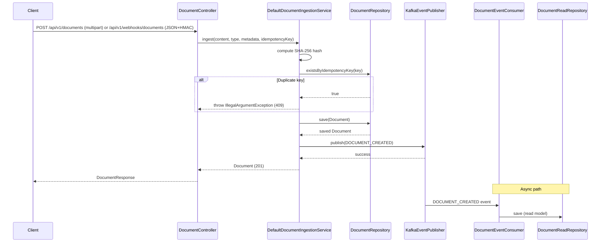
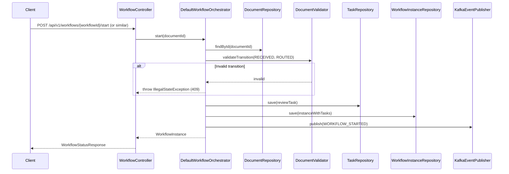
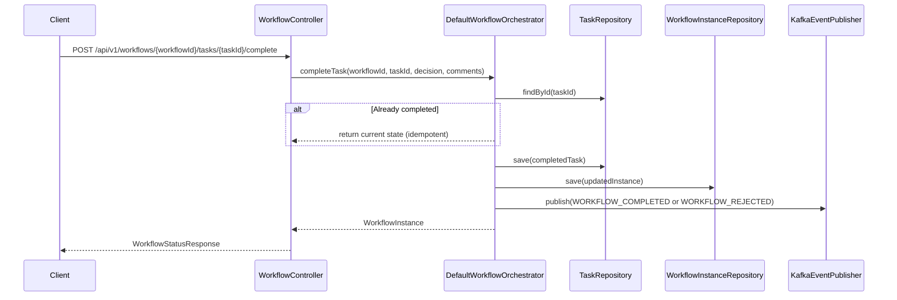
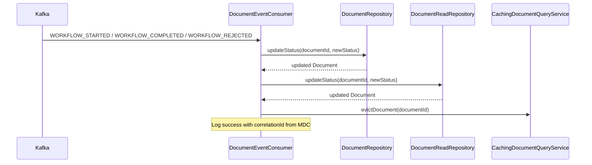

# Architecture Case Study: meridian-workflow-engine

> **Scope:** This document describes what was built, why it was built that way, and what remains unimplemented. Every architectural claim maps to specific code in this repository.

---

## 1. Problem

Organizations that process invoices, contracts, and compliance documents need a reliable pipeline that:

- Accepts documents from multiple sources (UI upload, external webhooks)
- Validates content and metadata before routing
- Assigns review/approval tasks to human actors
- Records authoritative state transitions with full lineage
- Survives partial failures without silent data loss

The repository implements a **document-centric workflow engine** that demonstrates how to build such a system with clear separation of concerns, explicit failure handling, and testable boundaries.

### Code references

- Document ingestion: `meridian-application/src/main/java/com/meridian/application/service/DefaultDocumentIngestionService.java:51`
- Workflow orchestration: `meridian-application/src/main/java/com/meridian/application/service/DefaultWorkflowOrchestrator.java:58`
- Event-driven status updates: `meridian-infrastructure/src/main/java/com/meridian/infrastructure/messaging/kafka/DocumentEventConsumer.java:36`

---

## 2. Goals and Non-Goals

### Goals (implemented)

| Goal | Status | Evidence |
|------|--------|----------|
| Enforce dependency direction: domain has zero outward dependencies | Implemented | `meridian-domain/pom.xml` has no Spring/JPA dependencies |
| Separate business logic from frameworks via ports/adapters | Implemented | `meridian-application` defines interfaces; `meridian-infrastructure` implements them |
| Make workflow state transitions explicit and validated | Implemented | `WorkflowState` enum (`STARTED`, `COMPLETED`, `REJECTED`), `DocumentValidator.validateTransition()` |
| Make task completion idempotent | Implemented | `DefaultWorkflowOrchestrator.completeTask()` returns current state if task already `COMPLETED` |
| Detect concurrent modifications | Implemented | `@Version` on `DocumentEntity`, `WorkflowInstanceEntity`, `WorkflowTaskEntity` |
| Propagate correlation IDs across HTTP and Kafka | Implemented | `CorrelationIdFilter`, MDC usage in `DocumentEventConsumer` |
| Expose business metrics | Implemented | `WorkflowMetrics` counters via Micrometer/Prometheus |
| Document API contracts with OpenAPI | Implemented | Springdoc annotations on all controllers |

### Non-Goals (explicitly not implemented)

| Non-Goal | Reason |
|----------|--------|
| Multi-tenancy with tenant isolation | `Document.create()` accepts `tenantId` but repositories do not filter by it |
| Distributed transactions across services | Single service, single database; no saga or outbox |
| Horizontal scaling of workflow processing | Kafka consumer group is single-instance; no partitioning strategy |
| High-availability database cluster | Single PostgreSQL instance |
| Fine-grained authorization (RBAC per document type) | Only `ROLE_OPERATOR`, `ROLE_REVIEWER`, `ROLE_ADMIN` |
| Event sourcing or append-only audit log | Audit log is a mutable table queried by time range |
| Dead-letter queue for Kafka | Failed events propagate and are redelivered by Kafka indefinitely |
| CQRS for workflow queries | Documented in ADR-006 but not implemented; read model is a separate table but not independently writeable |

---

## 3. Architecture

### Layered structure (hexagonal)

```
meridian-domain           # Pure Java, zero framework deps
    ↓ uses ports (interfaces)
meridian-application      # Use cases + port definitions
    ↓ implements ports
meridian-infrastructure   # Adapters: JPA, Kafka, Security, Web
    ↓ bootstraps
meridian-workflow-service # Spring Boot application
```

**Dependency rule:** Dependencies point inward only. `meridian-domain` has no knowledge of Spring, JPA, or Kafka. `meridian-application` depends only on `meridian-domain`. `meridian-infrastructure` depends on both. `meridian-workflow-service` depends on all three and provides wiring.

### Code mapping

- Domain aggregates: `Document.java`, `WorkflowInstance.java`, `WorkflowTask.java`
- Domain services: `DocumentValidator.java`
- Inbound ports: `IngestDocumentUseCase.java`, `StartWorkflowUseCase.java`, `CompleteTaskUseCase.java`, `QueryDocumentUseCase.java`, `QueryWorkflowStatusUseCase.java`
- Outbound ports: `DocumentRepository.java`, `TaskRepository.java`, `WorkflowInstanceRepository.java`, `EventPublisher.java`, `NotificationService.java`, `AuditService.java`, `DocumentReadRepository.java`
- Infrastructure adapters: `JpaDocumentRepository.java`, `JpaTaskRepository.java`, `JpaWorkflowInstanceRepository.java`, `KafkaEventPublisher.java`, `DocumentEventConsumer.java`, `SecurityConfig.java`

---

## 4. Major Components

### 4.1 Domain Layer (`meridian-domain`)

**Status:** Fully implemented.

- **Aggregates:** `Document`, `WorkflowInstance`
- **Entities:** `WorkflowTask`
- **Value Objects:** `DocumentId`, `WorkflowId`
- **Enums:** `DocumentStatus` (`RECEIVED`, `VALIDATING`, `ROUTED`, `PROCESSING`, `COMPLETED`, `REJECTED`, `ARCHIVED`), `WorkflowState` (`STARTED`, `COMPLETED`, `REJECTED`), `TaskStatus` (`PENDING`, `ASSIGNED`, `COMPLETED`), `DocumentType` (`INVOICE`, `RECEIPT`, `CONTRACT`, `REPORT`), `Priority` (`LOW`, `NORMAL`, `HIGH`)
- **Domain Services:** `DocumentValidator` — validates document business rules and state transitions
- **Events:** `DocumentEvent` — immutable record with `eventType`, `payload`, `correlationId`, `occurredAt`

**Notable:** `Document` is a Java record with a factory method `create()` that sets initial state to `RECEIVED`. `WorkflowInstance` is also a record with a `start()` factory. State transitions are performed by creating new instances (immutable records), not mutating existing ones.

### 4.2 Application Layer (`meridian-application`)

**Status:** Fully implemented.

- **Use cases (inbound ports):**
  - `IngestDocumentUseCase.ingest()` — accepts file content, type, metadata, idempotency key
  - `StartWorkflowUseCase.start()` — creates workflow instance and initial task
  - `CompleteTaskUseCase.completeTask()` — completes a task and transitions workflow
  - `QueryDocumentUseCase.getDocument()` / `listDocuments()`
  - `QueryWorkflowStatusUseCase.getStatus()`

- **Services (orchestration):**
  - `DefaultDocumentIngestionService` — validates, hashes, saves document, publishes event
  - `DefaultWorkflowOrchestrator` — starts workflows, completes tasks, emits events

- **Outbound ports (interfaces):**
  - `DocumentRepository` — CRUD + `updateStatus()` + `existsByIdempotencyKey()`
  - `TaskRepository` — CRUD + `findByWorkflowId()`
  - `WorkflowInstanceRepository` — CRUD
  - `EventPublisher` — single `publish(DocumentEvent)` method
  - `NotificationService` — `notifyTaskAssigned()`
  - `AuditService` — `log()` + `query()`

### 4.3 Infrastructure Layer (`meridian-infrastructure`)

**Status:** Fully implemented for current scope.

- **Persistence:**
  - JPA entities: `DocumentEntity`, `WorkflowInstanceEntity`, `WorkflowTaskEntity`, `DocumentReadEntity`, `AuditLogEntity`
  - Spring Data JPA repositories: `DocumentJpaRepository`, `WorkflowTaskJpaRepository`, `WorkflowInstanceJpaRepository`, `AuditLogJpaRepository`
  - Port adapters: `JpaDocumentRepository`, `JpaTaskRepository`, `JpaWorkflowInstanceRepository`, `PersistenceAuditService`
  - Optimistic locking: `@Version` on all mutable entities
  - Metadata serialization: `EncryptedMetadataConverter` (AES encryption at rest)

- **Messaging:**
  - `KafkaEventPublisher` — sends `DocumentEvent` to topic based on event type
  - `DocumentEventConsumer` — listens on `document.events`, `workflow.tasks`, `workflow.completed`; updates document status in write and read models

- **Security:**
  - `SecurityConfig` — OAuth2 resource server, JWT decoder (JWKS or symmetric secret)
  - `MethodSecurityConfig` — custom `DocumentSecurityExpressionRoot` with `hasDocumentAccess()`
  - `WebhookAuthenticationFilter` — HMAC-SHA256 signature validation for `/api/v1/webhooks/documents`
  - `CorrelationIdFilter` — generates/propagates `X-Correlation-ID`

- **Web:**
  - `DocumentController` — ingest (multipart), webhook ingest (JSON), list, get by ID
  - `WorkflowController` — get status, complete task
  - `AuditLogController` — query audit logs (ADMIN only)
  - `GlobalExceptionHandler` — structured `ErrorResponse` with correlation ID

- **Observability:**
  - `WorkflowMetrics` — Micrometer counters
  - `KafkaHealthIndicator` — checks Kafka producer availability
  - `RedisHealthIndicator` — checks Redis availability
  - `AuditAspect` — logs security checks to audit table

- **Caching:**
  - `CachingDocumentQueryService` — `@Cacheable` on `getDocument()`, `@CacheEvict` on status updates

### 4.4 Service Layer (`meridian-workflow-service`)

**Status:** Fully implemented for current scope.

- Spring Boot application entry point
- Configuration: security, Kafka, Actuator, Flyway, cache
- No business logic; pure wiring

---

## 5. Data Flow

### 5.1 Document Ingestion



**Code path:**
- Controller: `DocumentController.ingestDocument()` (`DocumentController.java:52`) or `ingestDocumentViaWebhook()` (`DocumentController.java:80`)
- Service: `DefaultDocumentIngestionService.ingest()` (`DefaultDocumentIngestionService.java:51`)
- Repository: `JpaDocumentRepository.save()` (`JpaDocumentRepository.java:26`)
- Event: `KafkaEventPublisher.publish()` (`KafkaEventPublisher.java:40`)

### 5.2 Workflow Start



**Code path:**
- Service: `DefaultWorkflowOrchestrator.start()` (`DefaultWorkflowOrchestrator.java:59`)
- Validation: `DocumentValidator.validateTransition()` (`meridian-domain/.../DocumentValidator.java`)
- Transaction: `@Transactional` on `start()` (`DefaultWorkflowOrchestrator.java:58`)

### 5.3 Task Completion



**Code path:**
- Service: `DefaultWorkflowOrchestrator.completeTask()` (`DefaultWorkflowOrchestrator.java:119`)
- Transaction: `@Transactional` on `completeTask()` (`DefaultWorkflowOrchestrator.java:118`)
- Idempotency: `if (task.status() == TaskStatus.COMPLETED) return current` (`DefaultWorkflowOrchestrator.java:123`)

### 5.4 Event Processing (Read Model Update)



**Code path:**
- Consumer: `DocumentEventConsumer.onDocumentEvent()` (`DocumentEventConsumer.java:36`)
- Status update: `JpaDocumentRepository.updateStatus()` (`JpaDocumentRepository.java:51`)
- Cache eviction: `CachingDocumentQueryService.evictDocument()` (`CachingDocumentQueryService.java:27`)

---

## 6. Security Boundaries

### 6.1 Authentication

**Status:** Implemented.

- All API endpoints except `/actuator/health`, `/actuator/info`, and `/api/v1/webhooks/documents` require a valid JWT.
- JWT verification: `SecurityConfig.jwtDecoder()` (`SecurityConfig.java:54`) supports JWKS URI or symmetric secret.
- Startup fails if neither `JWT_JWKS_URI` nor `JWT_SECRET_KEY` is set (`SecurityConfig.java:25-29`).

### 6.2 Authorization

**Status:** Implemented at method level.

| Endpoint | Required Role | Expression |
|----------|--------------|------------|
| `POST /api/v1/documents` | `OPERATOR` | `hasRole('OPERATOR')` |
| `GET /api/v1/documents` | `OPERATOR` or `ADMIN` | `hasRole('OPERATOR') or hasRole('ADMIN')` |
| `GET /api/v1/documents/{documentId}` | Document-level | `hasDocumentAccess(#documentId)` |
| `GET /api/v1/workflows/{workflowId}` | `OPERATOR`, `REVIEWER`, or `ADMIN` | `hasRole('OPERATOR') or hasRole('REVIEWER') or hasRole('ADMIN')` |
| `POST /api/v1/workflows/{workflowId}/tasks/{taskId}/complete` | `REVIEWER` | `hasRole('REVIEWER')` |
| `GET /api/v1/audit` | `ADMIN` | `hasRole('ADMIN')` |
| `POST /api/v1/webhooks/documents` | None (HMAC) | `permitAll()` + `WebhookAuthenticationFilter` |

**Custom authorization:** `DocumentSecurityExpressionRoot.hasDocumentAccess()` (`DocumentSecurityExpressionRoot.java:25`) checks:
1. `ROLE_ADMIN` → allow
2. ACL table (`document_acl`) → allow if actor matches
3. Task assignee → allow if username matches any task assignee for the workflow

### 6.3 Webhook Authentication

**Status:** Implemented.

- `WebhookAuthenticationFilter` (`WebhookAuthenticationFilter.java:16`) validates `X-HMAC-Signature` using HMAC-SHA256.
- Secret is loaded from `WEBHOOK_SECRET` environment variable via `@Value`.
- Startup fails if `WEBHOOK_SECRET` is not set (`WebhookAuthenticationFilter.java:23`).
- No hardcoded fallback secret in production code.

### 6.4 Audit Logging

**Status:** Partially implemented.

- `AuditAspect` (`AuditAspect.java:28`) logs every `@PreAuthorize` security check to the `audit_logs` table via `AuditService`.
- Application-level audit events are logged in `DefaultWorkflowOrchestrator` (`DefaultWorkflowOrchestrator.java:95`, `DefaultWorkflowOrchestrator.java:176`) and `DefaultDocumentIngestionService` (`DefaultDocumentIngestionService.java:77`).
- `AuditLogController` exposes audit logs to ADMIN role with result limit of 1000 (`AuditLogController.java:24`).
- **Gap:** `AuditLog` record stores `ipAddress` and `userAgent`, but `AuditLogResponse` DTO does not expose them. This is intentional for data minimization, but the raw fields are still persisted.

### 6.5 Secrets Management

**Status:** Implemented with caveats.

- `WEBHOOK_SECRET` required via environment variable.
- `JWT_SECRET_KEY` or `JWT_JWKS_URI` required via environment variable.
- No secrets appear in logs. Error responses sanitize internal IDs (`GlobalExceptionHandler.sanitize()`).

---

## 7. Persistence Model

### 7.1 Database

**Status:** PostgreSQL with Flyway migrations.

- Connection: configured via `DATABASE_URL`, `DATABASE_USERNAME`, `DATABASE_PASSWORD` environment variables (`application.yml:8-10`).
- Flyway enabled (`application.yml:21`) with `baseline-on-migrate: true`.
- JPA `ddl-auto: none` (`application.yml:14`) — schema is managed by Flyway, not Hibernate.

### 7.2 Tables and Relationships

```
documents
  id (PK), content_hash, metadata (jsonb), status, type, priority,
  created_at, updated_at, version (optimistic lock), idempotency_key (unique)

document_reads
  id (PK), content_hash, metadata (jsonb), status, type, priority, created_at

workflow_instances
  id (PK), document_id (FK), state, context (jsonb), correlation_id,
  started_at, completed_at, version (optimistic lock), created_at

workflow_tasks
  id (PK), workflow_id (FK), assignee, action, status,
  due_at, completed_at, completed_by, comments, created_at, version (optimistic lock)

audit_logs
  id (PK), actor, action, resource_type, resource_id, ip_address, user_agent,
  details (jsonb), occurred_at, created_at

document_acl
  (structure not shown in code; used by DocumentSecurityExpressionRoot)
```

**Code references:**
- `DocumentEntity` (`DocumentEntity.java:8`)
- `WorkflowInstanceEntity` (`WorkflowInstanceEntity.java:8`)
- `WorkflowTaskEntity` (`WorkflowTaskEntity.java:8`)
- `AuditLogEntity` (`AuditLogEntity.java`)

### 7.3 Optimistic Locking

**Status:** Implemented on all mutable entities.

- `DocumentEntity`: `@Version` on `version` column (`DocumentEntity.java:36-38`)
- `WorkflowInstanceEntity`: `@Version` on `version` column (`WorkflowInstanceEntity.java:32-34`)
- `WorkflowTaskEntity`: `@Version` on `version` column (`WorkflowTaskEntity.java:41-43`)
- JPA automatically throws `OptimisticLockingFailureException` on version conflict.

### 7.4 Read Model (CQRS partial)

**Status:** Partially implemented.

- `DocumentReadEntity` and `DocumentReadRepository` exist as a separate read-optimized table.
- `DocumentEventConsumer.updateStatus()` updates both write and read models (`DocumentEventConsumer.java:69-72`).
- **Not implemented:** The read model is not independently writeable; it is entirely derived from the write model via Kafka events. There is no query API that reads exclusively from the read model — `QueryDocumentUseCase` reads from `DocumentRepository` (write model) with a caching decorator.

### 7.5 Metadata Encryption

**Status:** Implemented at rest.

- `DocumentEntity.metadata` uses `@Convert(converter = EncryptedMetadataConverter.class)` (`DocumentEntity.java:18`).
- `EncryptedMetadataConverter` encrypts/decrypts metadata using AES.

---

## 8. Important Architectural Decisions

See the ADR directory for full rationale.

| ADR | Decision | Status |
|-----|----------|--------|
| ADR-001 | Hexagonal architecture with Maven multi-module | Implemented |
| ADR-002 | Event-driven workflow with Kafka | Implemented |
| ADR-003 | JWT-based OAuth2 resource server | Implemented |
| ADR-004 | Flyway for database versioning | Implemented |
| ADR-005 | Testcontainers for integration tests | Implemented |
| ADR-006 | CQRS for workflow queries | Partially implemented (read model exists but is not independently queried) |
| ADR-007 | Concurrency control and state machine validation | Implemented |

---

## 9. Failure Handling

### 9.1 Transaction Boundaries

**Status:** Implemented.

- `DefaultDocumentIngestionService.ingest()` — `@Transactional` (`DefaultDocumentIngestionService.java:50`)
- `DefaultWorkflowOrchestrator.start()` — `@Transactional` (`DefaultWorkflowOrchestrator.java:58`)
- `DefaultWorkflowOrchestrator.completeTask()` — `@Transactional` (`DefaultWorkflowOrchestrator.java:118`)
- `DefaultWorkflowOrchestrator.getStatus()` — `@Transactional(readOnly = true)` (`DefaultWorkflowOrchestrator.java:192`)

If any exception occurs within these methods, the entire transaction rolls back. No partial state is committed.

### 9.2 Best-Effort Async Side Effects

**Status:** Implemented.

- Event publishing and notifications are wrapped in `publishEventAsync()` (`DefaultWorkflowOrchestrator.java:199`), which catches exceptions and logs them.
- If Kafka is unavailable, the DB transaction still commits; the event loss is logged and can be replayed manually.
- **Trade-off:** This means the write model and read model can temporarily diverge if event publication fails. The system is eventually consistent, not strongly consistent.

### 9.3 Idempotency

**Status:** Implemented.

- Document ingestion: unique constraint on `idempotency_key` + pre-check via `existsByIdempotencyKey()` (`DefaultDocumentIngestionService.java:59`). Note: there is a TOCTOU race between the check and the insert; the database unique constraint is the ultimate guard.
- Task completion: domain guard in `DefaultWorkflowOrchestrator.completeTask()` returns current state if task already `COMPLETED` (`DefaultWorkflowOrchestrator.java:123`).
- Kafka events: `JpaDocumentRepository.updateStatus()` is a no-op if current status equals new status (`JpaDocumentRepository.java:55-58`).

### 9.4 Retry Behavior

**Status:** Partially implemented.

- Kafka producer: `retries: 3`, `acks: all`, `enable-idempotency: true` (`application.yml:33-36`).
- Kafka consumer: `enable-auto-commit: false` (`application.yml:42`) — offsets are committed only after successful processing.
- Failed events propagate as `RuntimeException` from `DocumentEventConsumer`, causing Kafka to redeliver.
- **Not implemented:** No max-redelivery limit or dead-letter queue. A poison message will be redelivered indefinitely.

### 9.5 Malformed Events

**Status:** Handled.

- `DocumentEventConsumer` catches `Exception` during JSON parsing, logs the error, and rethrows (`DocumentEventConsumer.java:59-61`). This causes Kafka to redeliver the message. The consumer thread is not killed.

### 9.6 Cache Invalidation

**Status:** Implemented.

- `CachingDocumentQueryService` evicts the document cache on every status update (`DocumentEventConsumer.java:72`).
- `@Cacheable` on `getDocument()` (`CachingDocumentQueryService.java:22`).

---

## 10. Concurrency Model

### 10.1 Optimistic Locking

**Status:** Implemented.

- All mutable entities have `@Version`.
- Concurrent modifications result in `OptimisticLockingFailureException`, which is caught by the client or propagates as a 409 response.
- Tests: `OptimisticLockingIntegrationTest` (`OptimisticLockingIntegrationTest.java`), `ConcurrencyDeterministicTest` (`ConcurrencyDeterministicTest.java`)

### 10.2 State Machine Guards

**Status:** Implemented.

- `WorkflowTask.assign()` rejects non-`PENDING` tasks (`WorkflowTask.java:45`).
- `WorkflowTask.complete()` rejects already-`COMPLETED` tasks (`WorkflowTask.java:64`).
- `DocumentValidator.validateTransition()` enforces allowed transitions (`DocumentValidator.java`).

### 10.3 Duplicate Event Processing

**Status:** Idempotent by design.

- `DocumentEventConsumer.updateStatus()` checks `currentStatus == newStatus` before writing (`JpaDocumentRepository.updateStatus()` at `JpaDocumentRepository.java:55`).
- Duplicate Kafka events are harmless no-ops.

### 10.4 Concurrent Workflow Starts

**Status:** Protected.

- First `start()` call transitions document from `RECEIVED` to `ROUTED` via Kafka event.
- Second `start()` call fails because document is no longer `RECEIVED` (`DocumentValidator` rejects invalid transition).
- Test: `ConcurrencyDeterministicTest.shouldDetectConcurrentWorkflowStartOnSameDocument` (`ConcurrencyDeterministicTest.java`)

---

## 11. Testing Strategy

### 11.1 Test Types

| Type | Tools | Coverage |
|------|-------|----------|
| Unit tests | JUnit 5, Mockito | Domain models, services, validators |
| Integration tests | Spring Boot Test, Testcontainers | Repositories, controllers, Kafka consumers |
| Contract tests | MockMvc, WebMvcTest | API endpoints, request/response schemas |
| Concurrency tests | ExecutorService, CountDownLatch | Optimistic locking, idempotency |
| Resilience tests | Testcontainers, Awaitility | Transaction rollback, malformed events, duplicate events |

### 11.2 Testcontainers

**Status:** Implemented.

- `PostgreSQLContainer` for database integration tests.
- `KafkaContainer` for Kafka integration tests.
- Used in: `ConcurrencyIntegrationTest`, `ResilienceIntegrationTest`, `DocumentEventConsumerIntegrationTest`, `TaskRepositoryIntegrationTest`, `WorkflowInstanceRepositoryIntegrationTest`, etc.

### 11.3 Contract Tests

**Status:** Implemented.

- `DocumentControllerContractTest` — validates request/response schemas, status codes, pagination, authz.
- `WorkflowControllerContractTest` — validates workflow status and task completion contracts.

### 11.4 Security Tests

**Status:** Implemented.

- `WebhookSecurityTest` — HMAC signature validation.
- `WebhookEndToEndTest` — end-to-end webhook flow.
- `DocumentListSecurityTest`, `WorkflowAuthorizationTest`, `ErrorHandlingSecurityTest` — role-based access control.

---

## 12. Observability

### 12.1 Structured Logging

**Status:** Implemented.

- Logback pattern includes `[%X{correlationId}]` from MDC (`logback-spring.xml`).
- `CorrelationIdFilter` generates/propagates `X-Correlation-ID` header.
- Kafka consumer propagates `correlationId` from event payload into MDC (`DocumentEventConsumer.java:44-46`).

### 12.2 Metrics

**Status:** Implemented.

- Exposed at `/actuator/prometheus`.
- Business metrics via `WorkflowMetrics`:
  - `documents.ingested` — incremented after successful ingestion (`DefaultDocumentIngestionService.java:75`)
  - `workflows.started` — incremented after workflow start (`DefaultWorkflowOrchestrator.java:93`)
  - `tasks.completed` — incremented after task completion (`DefaultWorkflowOrchestrator.java:174`)
  - `events.publish.failures` — incremented on Kafka publish failure (`KafkaEventPublisher.java:53`)
  - `optimistic.lock.failures` — incremented on optimistic lock failure (`GlobalExceptionHandler.java:27`)
- Infrastructure metrics: JVM memory, CPU, HikariCP connection pool (via Actuator).

### 12.3 Health Checks

**Status:** Implemented.

- `/actuator/health` — liveness (public).
- `/actuator/health` with auth — readiness details (DB, Kafka, Redis).
- `KafkaHealthIndicator` — checks Kafka producer availability.
- `RedisHealthIndicator` — checks Redis availability.
- `show-details: when-authorized` — prevents information leakage to unauthenticated probes (`application.yml:54`).

### 12.4 Tracing

**Status:** Not implemented.

- No OpenTelemetry, Jaeger, or Zipkin integration.
- Correlation IDs are propagated but not exported to a distributed tracing backend.

### 12.5 Audit Log

**Status:** Partially implemented.

- Persisted to `audit_logs` table via `PersistenceAuditService`.
- Queried via `AuditLogController` (ADMIN only, max 1000 results).
- Captures security checks, workflow starts, task completions, document ingestion.
- Does not capture document status transitions from Kafka events.

---

## 13. Deployment

### 13.1 Containerization

**Status:** Implemented.

- `docker-compose.yml` defines services for PostgreSQL, Kafka, Redis, and the application.
- Multi-stage Docker build for the backend.

### 13.2 Configuration

**Status:** Implemented via environment variables.

| Variable | Purpose | Required |
|----------|---------|----------|
| `DATABASE_URL` | PostgreSQL JDBC URL | Yes |
| `DATABASE_USERNAME` | DB username | Yes |
| `DATABASE_PASSWORD` | DB password | Yes |
| `JWT_JWKS_URI` or `JWT_SECRET_KEY` | JWT verification | Yes |
| `WEBHOOK_SECRET` | HMAC webhook secret | Yes (if webhook endpoint used) |
| `REDIS_HOST` / `REDIS_PORT` | Cache host/port | No (cache disabled if missing) |
| `spring.kafka.bootstrap-servers` | Kafka broker | Yes |

### 13.3 CI/CD

**Status:** GitHub Actions configured (referenced in README, not audited in detail).

---

## 14. Known Limitations

### 14.1 Architectural

| Limitation | Impact | Mitigation |
|------------|--------|------------|
| No dead-letter queue for Kafka | Poison messages cause infinite redelivery | Operational monitoring of consumer lag; manual offset skip |
| Single Kafka consumer group | No parallel processing of events for the same document | Acceptable for current throughput; Kafka partition key is document ID |
| Read model not independently queried | CQRS benefit not fully realized | `DocumentReadRepository` exists but is not exposed via dedicated query API |
| Audit log not captured for Kafka-driven status changes | Gap in audit trail for async transitions | Can be added by instrumenting `DocumentEventConsumer` |
| `DocumentValidator` only checks metadata presence | Minimal business validation | Acceptable for reference implementation; real deployment would add content validation |

### 14.2 Security

| Limitation | Impact | Mitigation |
|------------|--------|------------|
| CSRF disabled (`csrf().disable()`) | State-changing API endpoints vulnerable to CSRF if browser-based | Acceptable for service-to-service JWT auth; would enable CSRF for browser sessions |
| Webhook endpoint allows all HTTP methods via `permitAll()` | Other methods (GET, PUT, DELETE) on webhook path are unauthenticated | Low risk; webhook path is not documented for other methods |
| `hasDocumentAccess` uses `documentId` as `workflowId` in task lookup | Assumes workflow ID equals document ID | Works for current single-workflow-per-document model; would break if multiple workflows per document |
| Audit log stores IP and user agent but does not expose them via API | Not a security gap, but inconsistent | Intentional data minimization |

### 14.3 Observability

| Limitation | Impact | Mitigation |
|------------|--------|------------|
| No distributed tracing | Cannot trace a request across HTTP → service → Kafka → consumer | Correlation IDs provide manual tracing |
| No SLI/SLO dashboards | Operators cannot measure latency or error rates | Metrics are exported; dashboards must be built externally |
| Cache TTL not configurable | 10-minute TTL is hardcoded in `CachingDocumentQueryService` | Acceptable for current scale |

### 14.4 Testing

| Limitation | Impact | Mitigation |
|------------|--------|------------|
| No frontend tests documented | Angular UI not covered in this backend case study | Separate frontend test suite exists but not audited here |
| `ResilienceIntegrationTest` uses `TestPropertySource` for webhook secret | Tests would fail if env var not set | Documented in test code |

---

## 15. Future Work

### 15.1 Implemented but Not Enabled

| Feature | Status | Location |
|---------|--------|----------|
| CQRS read model | Partially implemented | `DocumentReadEntity`, `DocumentReadRepository`, `DocumentEventConsumer` updates it |
| Redis cache eviction | Implemented | `CachingDocumentQueryService.evictDocument()` called on status updates |

### 15.2 Planned (from ADRs, not implemented)

| Feature | Rationale | Effort |
|---------|-----------|--------|
| Dead-letter queue for Kafka | Prevent infinite redelivery of poison messages | Medium — requires Kafka DLQ topic and consumer rebalance logic |
| Distributed tracing (OpenTelemetry) | Cross-service request tracing | Low-medium — add OpenTelemetry starter, instrument Kafka and HTTP |
| Saga pattern for multi-service workflows | If the system grows beyond a single service | High — requires outbox, compensation logic, and state machine redesign |
| Fine-grained RBAC | Per-document-type permissions | Medium — extend `DocumentSecurityExpressionRoot` and role hierarchy |
| Webhook signature algorithm agility | Support HMAC-SHA256 and future algorithms | Low — abstract `WebhookAuthenticationFilter` to strategy pattern |
| Document content validation | Currently only hash + metadata validated | Medium — add content inspection in `DocumentValidator` |
| Multi-tenancy | Tenant isolation at repository level | High — requires tenant ID propagation and query filtering |

---

## Appendix A: Code-to-Architecture Map

| Architectural Element | Primary Code Location |
|-----------------------|----------------------|
| Domain aggregate: Document | `meridian-domain/.../model/Document.java` |
| Domain aggregate: WorkflowInstance | `meridian-domain/.../model/WorkflowInstance.java` |
| Domain entity: WorkflowTask | `meridian-domain/.../model/WorkflowTask.java` |
| Domain service: DocumentValidator | `meridian-domain/.../service/DocumentValidator.java` |
| Inbound port: IngestDocumentUseCase | `meridian-application/.../port/inbound/IngestDocumentUseCase.java` |
| Inbound port: CompleteTaskUseCase | `meridian-application/.../port/inbound/CompleteTaskUseCase.java` |
| Outbound port: DocumentRepository | `meridian-application/.../port/outbound/DocumentRepository.java` |
| Outbound port: EventPublisher | `meridian-application/.../port/outbound/EventPublisher.java` |
| Service: DefaultDocumentIngestionService | `meridian-application/.../service/DefaultDocumentIngestionService.java` |
| Service: DefaultWorkflowOrchestrator | `meridian-application/.../service/DefaultWorkflowOrchestrator.java` |
| Adapter: JpaDocumentRepository | `meridian-infrastructure/.../persistence/repository/JpaDocumentRepository.java` |
| Adapter: KafkaEventPublisher | `meridian-infrastructure/.../messaging/kafka/KafkaEventPublisher.java` |
| Adapter: DocumentEventConsumer | `meridian-infrastructure/.../messaging/kafka/DocumentEventConsumer.java` |
| Security: SecurityConfig | `meridian-infrastructure/.../security/config/SecurityConfig.java` |
| Security: DocumentSecurityExpressionRoot | `meridian-infrastructure/.../security/config/DocumentSecurityExpressionRoot.java` |
| Web: DocumentController | `meridian-infrastructure/.../web/rest/DocumentController.java` |
| Web: WorkflowController | `meridian-infrastructure/.../web/rest/WorkflowController.java` |
| Observability: WorkflowMetrics | `meridian-infrastructure/.../observability/WorkflowMetrics.java` |
| Health: KafkaHealthIndicator | `meridian-infrastructure/.../health/KafkaHealthIndicator.java` |
| Cache: CachingDocumentQueryService | `meridian-infrastructure/.../cache/CachingDocumentQueryService.java` |
| Audit: AuditAspect | `meridian-infrastructure/.../audit/AuditAspect.java` |

---

## Appendix B: API Contract Summary

### Endpoints

| Method | Path | Auth | Request | Response | Status Codes |
|--------|------|------|---------|----------|--------------|
| POST | `/api/v1/documents` | JWT + `ROLE_OPERATOR` | `multipart/form-data` (file, type, priority, metadata, idempotencyKey) | `DocumentResponse` | 201, 400, 401, 409 |
| POST | `/api/v1/webhooks/documents` | HMAC (`X-HMAC-Signature`) | JSON `WebhookDocumentRequest` | `DocumentResponse` | 201, 400, 401 |
| GET | `/api/v1/documents` | JWT + `ROLE_OPERATOR` or `ROLE_ADMIN` | Query: `page`, `size` | `List<DocumentResponse>` | 200, 401, 403 |
| GET | `/api/v1/documents/{documentId}` | JWT + `hasDocumentAccess` | Path: `documentId` | `DocumentResponse` | 200, 401, 403, 404 |
| GET | `/api/v1/workflows/{workflowId}` | JWT + `ROLE_OPERATOR/REVIEWER/ADMIN` | Path: `workflowId` | `WorkflowStatusResponse` | 200, 401, 403, 404 |
| POST | `/api/v1/workflows/{workflowId}/tasks/{taskId}/complete` | JWT + `ROLE_REVIEWER` | Body: `CompleteTaskRequest` | `WorkflowStatusResponse` | 200, 400, 401, 403, 404, 409 |
| GET | `/api/v1/audit` | JWT + `ROLE_ADMIN` | Query: `actor`, `resourceType`, `resourceId`, `from`, `to` | `List<AuditLogResponse>` | 200, 401, 403 |

### Response Schemas

**DocumentResponse** (no `contentHash` — excluded from API):
```json
{
  "documentId": "string",
  "status": "RECEIVED | VALIDATING | ROUTED | PROCESSING | COMPLETED | REJECTED | ARCHIVED",
  "type": "INVOICE | RECEIPT | CONTRACT | REPORT",
  "priority": "LOW | NORMAL | HIGH",
  "metadata": {},
  "createdAt": "ISO-8601"
}
```

**WorkflowStatusResponse** (`state` is enum, not string):
```json
{
  "workflowId": "string",
  "documentId": "string",
  "state": "STARTED | COMPLETED | REJECTED",
  "currentTask": { ... TaskResponse or null },
  "startedAt": "ISO-8601",
  "completedAt": "ISO-8601 or null"
}
```

**CompleteTaskRequest:**
```json
{
  "decision": "APPROVED | REJECTED",
  "comments": "string (max 4000 chars)"
}
```

**ErrorResponse:**
```json
{
  "status": 400,
  "error": "Bad Request",
  "message": "Human-readable message (IDs redacted)",
  "timestamp": "ISO-8601",
  "correlationId": "string or null"
}
```

---

## Appendix C: Event Schema

All events are `DocumentEvent` records serialized as JSON.

```json
{
  "id": "uuid",
  "documentId": "doc-123",
  "eventType": "DOCUMENT_CREATED | WORKFLOW_STARTED | TASK_ASSIGNED | WORKFLOW_COMPLETED | WORKFLOW_REJECTED",
  "payload": "{}",
  "occurredAt": "ISO-8601",
  "causationId": "uuid or null",
  "correlationId": "string"
}
```

**Topic routing** (`KafkaEventPublisher.java:44-48`):
- `TASK_ASSIGNED` → `workflow.tasks`
- `WORKFLOW_COMPLETED`, `WORKFLOW_REJECTED` → `workflow.completed`
- All others → `document.events`

**Consumer handling** (`DocumentEventConsumer.java:53-58`):
- `WORKFLOW_STARTED` → document status → `ROUTED`
- `WORKFLOW_COMPLETED` → document status → `COMPLETED`
- `WORKFLOW_REJECTED` → document status → `REJECTED`
- Unknown events → logged at DEBUG, no state change

---

## Appendix D: Production Readiness Assessment

| Dimension | Status | Notes |
|-----------|--------|-------|
| Functional completeness | Partial | Core ingestion and workflow paths work; no admin UI backend beyond audit log query |
| Data safety | Implemented | Transactions, optimistic locking, idempotency keys |
| Failure resilience | Partial | Best-effort event publishing; no DLQ; no circuit breakers |
| Security | Implemented | JWT auth, method security, HMAC webhooks, audit logging |
| Observability | Partial | Metrics + health + structured logs; no distributed tracing |
| Operability | Partial | Docker Compose for demo; no Helm charts, no Kubernetes probes documented |
| Scalability | Not implemented | Single consumer group; no sharding strategy |
| Test coverage | Good | Unit, integration, contract, concurrency, resilience tests with Testcontainers |

**Bottom line:** This is a credible reference implementation for document-centric workflow orchestration with clear architectural boundaries and real failure handling. It is suitable for demonstration, prototyping, and as a teaching artifact. It is not production-ready without operational tooling (monitoring dashboards, alerting, DLQ management, backup/restore procedures) and additional hardening (CSRF for browser clients, distributed tracing, capacity planning).
