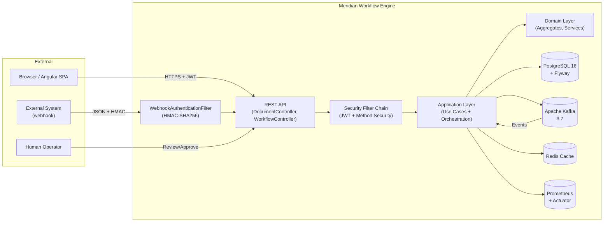
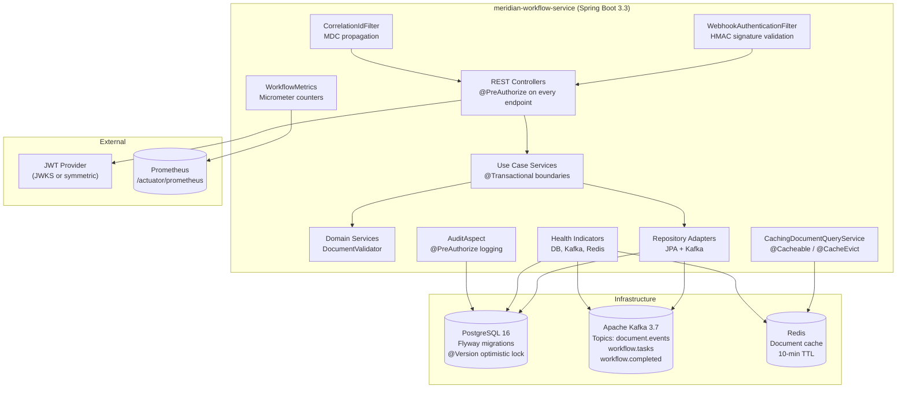
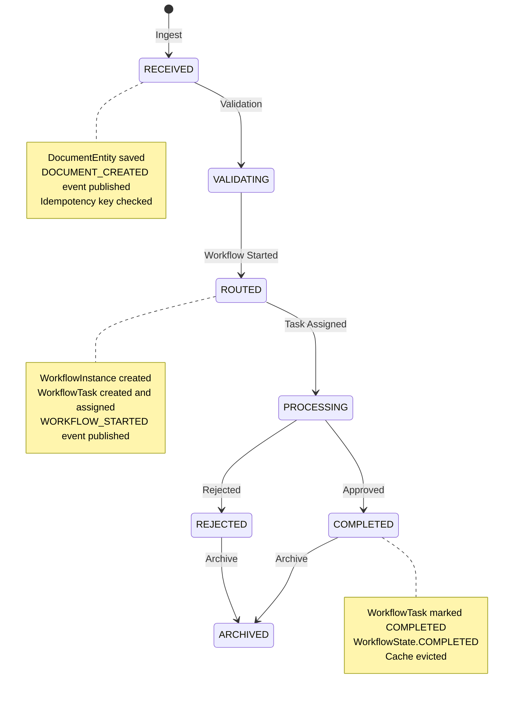
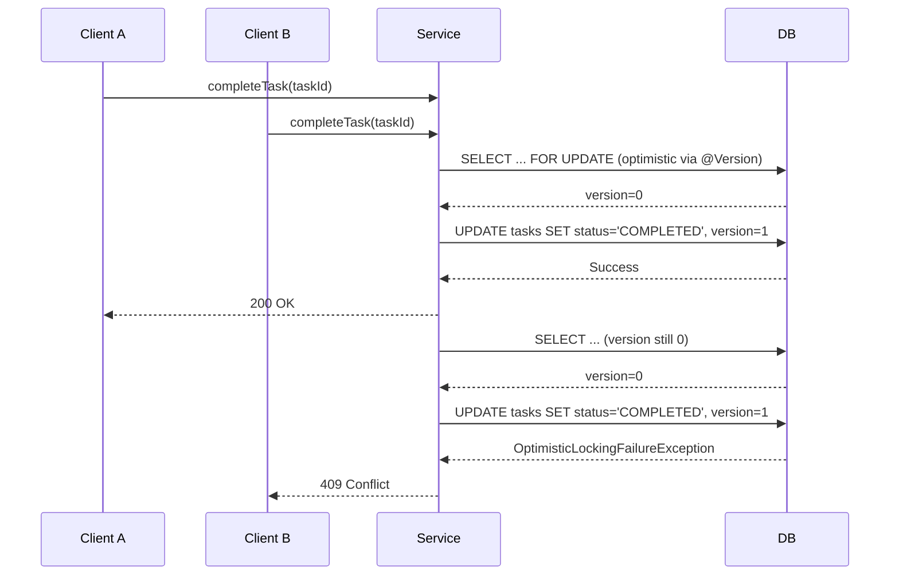

# Architecture Diagrams

## System Context



## Container Architecture



## Component Dependencies (Hexagonal)

```mermaid
graph TB
    subgraph "meridian-domain"
        Document["Document\n(aggregate)"]
        WorkflowInstance["WorkflowInstance\n(aggregate)"]
        WorkflowTask["WorkflowTask\n(entity)"]
        DocumentValidator["DocumentValidator\n(domain service)"]
        PortsIn["Inbound Ports\n(interfaces)"]
        PortsOut["Outbound Ports\n(interfaces)"]
    end

    subgraph "meridian-application"
        IngestionService["DefaultDocumentIngestionService\nimplements IngestDocumentUseCase"]
        Orchestrator["DefaultWorkflowOrchestrator\nimplements StartWorkflowUseCase\nCompleteTaskUseCase"]
        QueryService["DefaultDocumentQueryService\nimplements QueryDocumentUseCase"]
    end

    subgraph "meridian-infrastructure"
        JpaDocRepo["JpaDocumentRepository\nimplements DocumentRepository"]
        JpaTaskRepo["JpaTaskRepository\nimplements TaskRepository"]
        JpaWorkflowRepo["JpaWorkflowInstanceRepository\nimplements WorkflowInstanceRepository"]
        KafkaPub["KafkaEventPublisher\nimplements EventPublisher"]
        KafkaConsumer["DocumentEventConsumer\n@KafkaListener"]
        SecurityConfig["SecurityConfig\nOAuth2 + Method Security"]
        Controllers["REST Controllers\n@PreAuthorize"]
        MetricsComp["WorkflowMetrics\nMicrometer"]
    end

    IngestionService --> PortsOut
    Orchestrator --> PortsOut
    QueryService --> PortsOut

    PortsIn <--> IngestionService
    PortsIn <--> Orchestrator
    PortsIn <--> QueryService

    JpaDocRepo --> PortsOut
    JpaTaskRepo --> PortsOut
    JpaWorkflowRepo --> PortsOut
    KafkaPub --> PortsOut

    Controllers --> PortsIn

    IngestionService --> Document
    Orchestrator --> WorkflowInstance
    Orchestrator --> WorkflowTask
    IngestionService --> DocumentValidator
    Orchestrator --> DocumentValidator

    JpaDocRepo --> PostgreSQL[(PostgreSQL)]
    JpaTaskRepo --> PostgreSQL
    JpaWorkflowRepo --> PostgreSQL
    KafkaPub --> KafkaBroker[(Kafka)]
    KafkaConsumer --> KafkaBroker
    MetricsComp --> Prometheus[("Prometheus")]
```



## Data Flow: Document Lifecycle



## Concurrency Protection



## Event Processing Pipeline

```mermaid
graph LR
    subgraph "Producer Side"
        Orchestrator["DefaultWorkflowOrchestrator"]
        Publisher["KafkaEventPublisher\n@Transactional"]
        Topic1["document.events"]
        Topic2["workflow.tasks"]
        Topic3["workflow.completed"]
    end

    subgraph "Consumer Side"
        Listener["DocumentEventConsumer\n@KafkaListener\ngroup-id: meridian-workflow-service"]
        WriteRepo["DocumentRepository\nupdateStatus()"]
        ReadRepo["DocumentReadRepository\nupdateStatus()"]
        Cache["CachingDocumentQueryService\nevictDocument()"]
    end

    Orchestrator -->|publish()| Publisher
    Publisher -->|send| Topic1
    Publisher -->|send| Topic2
    Publisher -->|send| Topic3

    Topic1 -->|@KafkaListener| Listener
    Topic2 -->|@KafkaListener| Listener
    Topic3 -->|@KafkaListener| Listener

    Listener -->|1. update| WriteRepo
    Listener -->|2. update| ReadRepo
    Listener -->|3. evict| Cache

    WriteRepo --> DB[(PostgreSQL\nwrite model)]
    ReadRepo --> DB2[(PostgreSQL\nread model)]
    Cache --> Redis[(Redis)]
```
